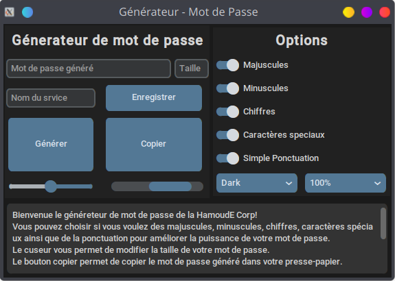

# Générateur de mots de passe - Python (CustomTkinter)

Ce projet est une application de bureau développée en Python utilisant **CustomTkinter**. Elle implemente la possibilité de générer, copier et enregistrer des mots de passe sécurisés selon des critères personnalisables.

## 🔐 Fonctionnalités

- Génération de mots de passe avec :
  - Majuscules
  - Minuscules
  - Chiffres
  - Caractères spéciaux
  - Ponctuation
- Choix de la longueur du mot de passe
- Interface moderne avec thème clair/sombre
- Copie automatique du mot de passe généré dans le presse-papiers
- Enregistrement dans un fichier `.txt` avec le nom du service associé
- Affichage dynamique de la difficulté du mot de passe (via une barre de progression) (non terminé)

## 🖼️ Aperçu



Interface graphique moderne avec CustomTkinter, adaptée aux préférences de l'utilisateur (dark/light mode, échelle ajustable).

## 🛠️ Technologies utilisées

- Python 3
- `customtkinter`
- `tkinter`
- `pyperclip`

## ▶️ Lancer l'application

### Prérequis

Assure-toi d’avoir Python 3 installé. Ensuite, installe les dépendances :

```bash
pip install customtkinter pyperclip
```

### Exécution

```bash
python mdp.py
```

## 💾 Enregistrement

Les mots de passe générés peuvent être enregistrés dans un fichier `mots_de_passe.txt`, accompagnés du nom du service choisi.

## 📁 Fichier principal

- `mdp.py` : le fichier principal contenant l’interface et toutes les fonctionnalités.

## 📌 À améliorer

- Le système de vérification de la complexité du mot de passe (`verif()`) est encore incomplet ou non relié à l'interface.
- Ajouter un affichage explicite du niveau de sécurité.
- Ajouter une image personnalisée à la fenêtre.

## Auteur

**Anas Sibarni** – Étudiant en B.U.T Informatique  
Projet réalisé dans le cadre de mes études.
